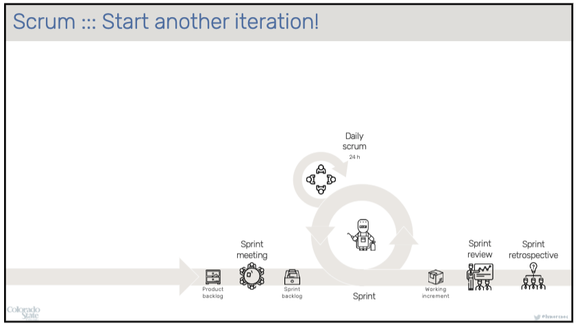

# HackersAnonymous
## About Project
* Board Game: Banqi
  * https://en.wikipedia.org/wiki/Banqi
  * https://en.wikipedia.org/wiki/Banqi

## Build
### build.sh
```Usage: ./build.sh```
* Installs the frontend dependencies (npm install)
* Installs the backend dependencies (mvn clean install)
* After building the project you will need to run host_frontend.sh and host_backend.sh
    * You will need 2 terminal tabs open to do this

### host_frontend.sh
```Usage: ./host_frontend.sh```
* Hosts the frontend code using webpack and npm (npm run dev)

### host_backend.sh
```Usage: ./host_backend.sh <Version>```
* Hosts the backend code using java jar (java -jar backend-<Version>.jar)
* For version look in backend/pom.xml or backend/target after building the project

## Roles
* Product Owner (TA & Instructor)
  * Represents the client
  * Prioritize product backlog items
  * Makes executive decisions
* Scrum Master (Evan)
  * Manages the process
  * Ensures team has what it needs to deliver value
  * Removes impediments to the team
* Development Team (Everybody)
  * Decides which backlog items go into the sprint

## MSCW By Priority
* Must Have
  * Tasks that need to be completed during the sprint
* Should Have
  * Tasks that should be completed during the sprint (but may not be)
* Could Have
  * Tasks that you could have finished during the sprint (less priority than Should Have)
* Would Have
  * Tasks that you would have finished during the sprint (least priority)

## Acceptance criteria 
* Acceptance criteria is defined for each user story inside of the comment.  


## SCRUM Flow

